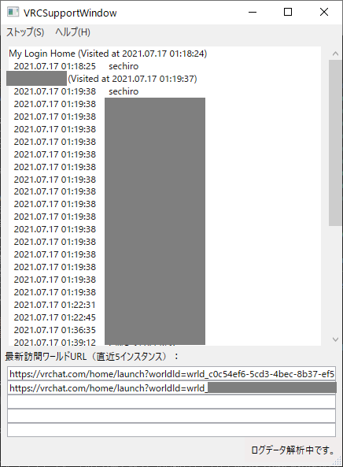

# VRCSupportWindow

このアプリは、VRChatのログをリアルタイムに解析して、巡ったワールドや出会ったユーザーを表示するアプリです。

最新バージョンのZipファイルをダウンロードし、解凍して、解凍後のフォルダの中にある「VRCSupporWindow.exe」を起動し、メニューの「スタート」をクリックすると、最新のVRChatログを読み取って、ウィンドウに訪問したワールドと出会ったユーザーがリアルタイムで表示されます。また、「ストップ」（ログ監視中に「スタート」と入れ替わりで表示）をクリックするとログ監視が停止されます。

※署名付きアプリではないので、起動時に警告が出ると思いますが、このアプリを信用していただけるのであれば、警告を確認の上、起動してください。

また、ウィンドウ下部の「最新訪問ワールドURL」には、訪問したインスタンスのURLが最新5件まで表示されます。
URLを右クリックし、「URLを開く」を選択すると最後に訪れたインスタンスのWebページがデフォルトのブラウザで開きます。
VRChatがエラー等で落ちてしまった時に元のワールドに戻る際の利用を想定しています。
（「URLをコピー」を選択するとクリップボードにURLがコピーされるので、それをお好きなブラウザに貼り付けて使うこともできます）

このアプリはリアルタイムでの表示に特化したアプリです。同様の内容を記録しておきたい場合は、わたしが配布している別アプリ「[VRCLogAnalyzer](https://sechiro.booth.pm/items/3053364)」をご利用ください。

## 動作環境

- OS: Windows 10 （64bit）
- SteamからVRChatを起動（Oculusからの起動は未確認）

## 動作説明

- VRChatのデフォルトのログパスからログファイルを取得し、情報を表示します。
- VRChatのログファイルは、VRChatアプリを起動するごとにつくられます。このアプリでのログ監視中に新しいログファイルができた場合は、自動的にそちらを読み込みます。
  - VRChat起動前からこのアプリでのログ監視を始めた場合は、最初に前回起動時のログを読み込みます。その後、VRChatを起動したら、新しくできたファイルに読み込み先が切り替わります。
- このアプリにはデータ保存機能はありません。（表示領域を右クリックすると、表示されている全文をコピーすることのみ可能です）